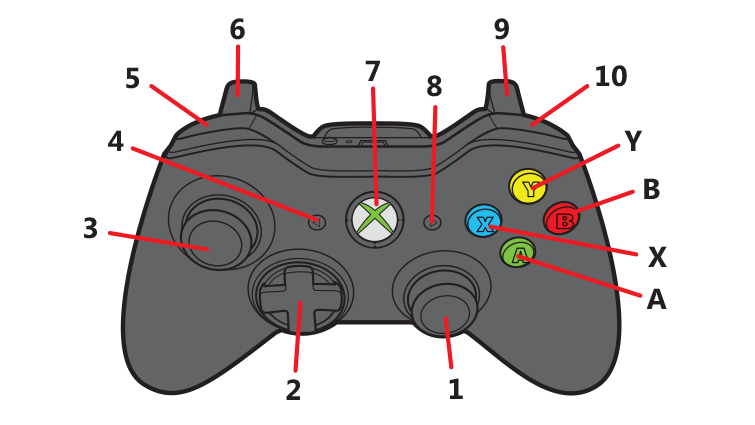

# Xbox Controller Button Mapping

This README file provides a visual mapping of every button on an Xbox controller.

## Button Descriptions

1. **Rigth Stick**: Turning Thorvald forward // Can only be used while driving forward
2. **D-pad**: Controlling arms in x and y direction // The arm can be switch by pressing Y
3. **Left stick**: Driving Thorvald forward
4. **Back Button**: Used to increese the arm speed
5. **LB Button**: Increese the driving speed
6. **LT Button**: Controll the arm in z-direction
7. **Xbox Button**: ---
8. **Start Button**: Decreese the arm speed
9. **RT Button**: Controll the arm in z-direction
10. **RB Button**: Decreese the driving speed
Y. **Y Button**: Change the arm that is being controlled
B. **B Button**: ---
A. **A Button**: Call the homing service that realign the wheels
X. **X Button**: Hold down to controll the end effector with d-pad

When **X Button** and **Y Button** are pressed the end effector reset it position to straight forward

## Usage

You can refer to this button mapping diagram when driving thorvald and controlling the arms with the teleop_node_py.py